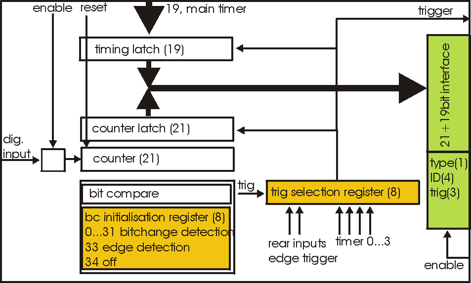
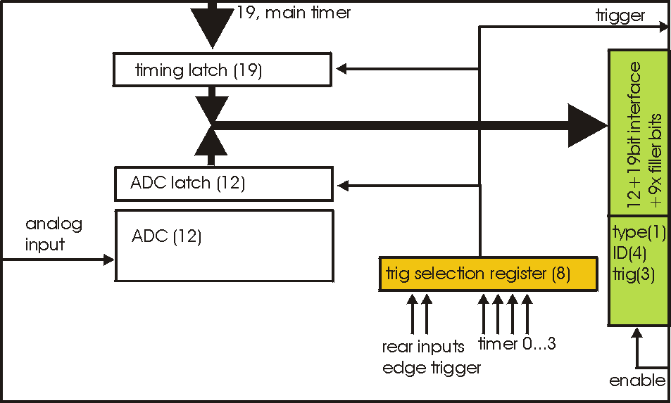

.. |mus|  unicode:: U+003BC s

Functional descriptions:
========================

All commands are used to control properties and behaviour of two main targets:

*   The peripheral modules MPSD-8
*   The central module(s) MCPD-8

| While MPSD-8 has only few properties to control, MCPD-8 is far more complex.
| Both are controlled by sending UPD based command buffers to MCPD-8. Commands for
  MPSD-8 are translated in the central module MCPD-8 and transmitted over the serial
  connections.

MPSD-8:
-------

| Each MPSD-8 has eight dual amplification stages. The gain values are kept
  symmetric internally, so there’s one gain value for each MPSD-8 channel.
| One common lower threshold for all eight channels allows neutron/gamma discrimination.

| A built in test pulser is useful for remote electronics checks without the need for
  neutron signals. Charge is injected at the preamp input, so the complete amplification,
  discrimination and position calculation process can be checked.
| The pulser signal can set to each of the eight channels and can be varied in
  amplitude and position.

Thus, a MPSD-8 has the following parameters to be controlled remotely:

Amplification and discrimination unit:

    *   8 gain values (8 bit)
    *   1 common lower threshold value (8 bit)

Test pulser unit:

    *   1 amplitude (8 bit)
    *   1 channel within module (0 … 7)
    *   1 position within channel (left / middle / right)
    *   on / off

MCPD-8:
-------

The central processing module MCPD-8 offers the following groups of
properties/functional modules:

Address and communication parameters:
~~~~~~~~~~~~~~~~~~~~~~~~~~~~~~~~~~~~~

**Device ID**

Each MCPD-8 in a system is given a device ID that is used for all communication.
The device ID can be set individually during initialisation and is remembered
after power up. It is in the responsibility of the user to keep IDs unique.

**Device ip address**

IP address of the MCPD-8. Also stored permanently, can be set to every valid address.

A “panic button” inside the MCPD-8 allows to reset the address to a default value
“192.168.168.121”.

**Data host ip address**

MCPD-8 is able to send data buffers to a dedicated DAQ ip address to split up data
taking and control tasks. This address can be preset and is remembered after power up.

**UDP port numbers**

UDP port number for command and data buffers can be set to a desired value. Values
are saved permanently. If not set, the port number of the last cmd packet is used.

Timing parameters:
~~~~~~~~~~~~~~~~~~

**Timing master**

A flag to define whether a device operates as timing master or slave.

**48 bit master clock**

Master timing register, can be set to any value and is incremented every 100 ns
during data acquisition.

**Termination of sync line**

Timing sync line has to be terminated at the end, so the last MCPD-8 has to be
set to sync “on”.

General properties:
~~~~~~~~~~~~~~~~~~~

**Run id**

An arbitrary 16 bit value to identify the current run. Value is transmitted in
every data buffer header. Run ID value of the master MCPD-8 will be propagated
via sync bus.

Functional units:
~~~~~~~~~~~~~~~~~~

| Besides the aggregation of neutron event data, MCPD-8 can contribute own data
  originating from six digital (TTL) and two analog inputs.
| To process these external signals, it provides functional units for triggering,
  counting and AD/DA conversion.

**Timer, counter, capture units, ports:**

An MCPD-8 offers a total of:

*   four auxiliary timers (16 bit wide, 10 |mus| time base, 655 ms max. period)
*   six triggerable counter cells (21 bit wide)
*   two triggerable ADC cells: 12 bit, +/-4,5 V
    (jumper closed)
    or 0...9V
    (open)
*   four multi-purpose counters (48 bit wide).
*   Two DAC ports: 12 bit, +/- 3 V
    (jumper closed)
    or 0…6 V
    (open)
*   One RS-232 serial port (default configuration 9.600, 8N1) can be used to
    control / read out external devices (HV sources, sample environment, ...).
    Strings can be sent and answers read back.

**Auxiliary timers:**

| Besides the central TOF timing unit, the MCPD-8 has four auxiliary timer units
  that are intended as trigger sources for auxiliary event triggering.
| Each auxiliary timer is a possible trigger source for one of the six counter
  cells or one of the two ADC cells.
| Triggering a counter or an ADC cell leads to the generation of a trigger event.
  A trigger event is a timestamped entry in data stream, comparable to a neutron
  data event. It carries the according counter value or ADC value together with
  the precise 19 bit timestamp. Auxiliary event data format is described above.

The auxiliary timers are reset automatically at DAQ start or reset. They have a
time base of 10 |mus| and a width of 16 bit, leading to a maximum period of 655,36
ms.

| A capture register associated with each timer defines the value at which the
  timer unit triggers the associated event(s).
| Every time the capture register equals the timer, a trigger is generated and the
  timer is reset. Thus it is possible to generate a trigger with a period between
  10 |mus| and 655.36 ms.

Timers are assigned to their data sources in the counter/ADC control registers.
One timer can trigger more than one data source.

Auxiliary timers do not stop at DAQ stop. This enables e.g. a continuous transfer
of ADC data when waiting for a change in sample environment.

Auxiliary timer configuration is done by :ref:`command #10 (set auxiliary timer) <cmd10>`,
the only parameter to submit is the capture register value.

Counter cells:
~~~~~~~~~~~~~~

| Counter cells can be used e.g. for monitor counters, chopper inputs, auxiliary
  timing purposes and more.
| They can be used as simple counters and are also able to generate timestamped
  events within the data stream.

They operate like shown schematically below:

|10000000000003B90000023D3DDAEC58_png|

**Inputs:**

| Each counter cell is driven by one dedicated TTL input.
| The assignment of input and counter cell is defined by hardware as follows:

+----------+---------------------+
| Cell No. | Input               |
+----------+---------------------+
| 0        | Monitor / Chopper 1 |
+----------+---------------------+
| 1        | Monitor / Chopper 2 |
+----------+---------------------+
| 2        | Monitor / Chopper 3 |
+----------+---------------------+
| 3        | Monitor / Chopper 4 |
+----------+---------------------+
| 4        | Dig. Input 1        |
+----------+---------------------+
| 5        | Dig. Input 2        |
+----------+---------------------+

| 4 x Monitor / Chopper on the frontpanel
| 2 x Digital Input on the backpanel

**Counters:**

Each cell has a 21 bit counter cell which increments on the **rising** edge of
the TTL input signal. There are two possibilities to read out the counters:

* | Counter values can be copied into each transmitted data buffer header by
    defining them as a source for a so called “Parameter”.
    (Please refer to the data buffer header description, as well as to the
    parameter command description for details.)
  | Thus they are transmitted whenever a data buffer is transmitted (which is
    every 40 ms minimum).
  | Parameters are latched at the time of buffer creation, so their values have
    the same timestamp as the header.
  | This operating mode is intended e.g. for continuous transmission of counter
    values, where a precise readout frequency or single event detection is not
    the issue. (e. g. monitor counters)

* | Counters can be configured to emit a timestamped trigger event, based on
    several trigger sources. When triggered, the latched values of the main timer
    (19 bit) and the counter (21 bit) are – together with some operational
    information – written into a trigger event like described above. The trigger
    event is then immediately buffered within the current data buffer.
  | This operating mode is intended for counter sources where detection and
    timestamping of single events (e.g. choppers), counter overflows (stop on
    monitor counts, ...) or a precise readout timing is required.

Both operating modes can be combined (e.g. configuring a monitor counter as a
parameter source *and* as a trigger event source.

**Triggering:**

Event trigger sources for a counter cell can be:

+------------+-------------------------------+
| Trigger ID | Trigger source                |
+------------+-------------------------------+
| 0          | No Trigger (only counting)    |
+------------+-------------------------------+
| 1          | Aux Timer 1                   |
+------------+-------------------------------+
| 2          | Aux Timer 2                   |
+------------+-------------------------------+
| 3          | Aux Timer 3                   |
+------------+-------------------------------+
| 4          | Aux Timer 4                   |
+------------+-------------------------------+
| 5          | Dig Input 1 (rear panel)      |
+------------+-------------------------------+
| 6          | Dig Input 2 (rear panel)      |
+------------+-------------------------------+
| 7          | Compare Register              |
|            | (allows also self triggering) |
+------------+-------------------------------+

Using one of the Aux Timers as trigger source will lead to generation of trigger
events with a frequency defined by the Aux Timer.

Digital Inputs will count and trigger on the rising edge of the TTL input signal.

Triggering by Compare register has three different operating modes:

*   writing a value from 0 to 20 triggers whenever the bit specified by the given
    value becomes **1**. For example: a compare register value of **0** will lead to
    triggering every second count, **2** triggers every eight counts ...
*   a compare register value of 21 triggers on counter overflow
*   a compare register value of 22 (as a special value) triggers on every rising
    edge of the input

Triggering on every rising edge for example allows to generate timestamped chopper
signals.

Configuring a counter / ADC cell just requires setting two values for the respective
cell address:

    trigger source:

    :0: no trigger
    :1..4: trigger on aux timer 1..4
    :5,6: trigger on rising edge at rear input 1, 2
    :7: trigger from compare register
        (7 only for counter cells)

    compare register (numerical value n):

    :0..20: trigger on bit n = 1
    :21: trigger on counter overflow
    :22: trigger on rising edge of input
         (can be left blank for ADC cells)

This setup is done using cmd #9 (Set counter / ADC cell), described in detail below.

ADC cells:
~~~~~~~~~~

| ADC cells operate principally similar to the counter cells. Their data have
  12 bit resolution (which are extended by 9 leading zeroes to keep the data
  format compatible).
| Full range is +/- 4,5 V or 0 .. 9 V, depending on jumper setting inside MCPD-8.

They can be used e.g. for a continuous monitoring of ambient parameters as well
as of sample environment. The ADC values are stored in registers at a sampling
rate of **25 kHz** they can be read out randomly at any time and rate. (although
their contents will only change with 25 kHz)

|10000000000003B90000023DABA92D42_png|

Inputs are the two analog inputs on the backpanel.

The ADC cells can be triggered by:

*   one of the four programmable auxilliary timers
*   one of the two digital inputs on the backpanel

Multipurpose counters (“Parameters”):
~~~~~~~~~~~~~~~~~~~~~~~~~~~~~~~~~~~~~

| MCPD-8 offers four additional 48 bit wide multipurpose counters / data fields.
| Their values are automatically transmitted as parameter 0 … 3 with every data
  buffer.

Data buffers will be emitted whenever an event buffer is full, but with a
minimum frequency of **25 Hz**. So the multipurpose counters are a good means for
a continuous monitoring of counting inputs.

All six TTL inputs can operate as counter source:
  | 4 x Monitor / Chopper on the frontpanel
  | 2 x Digital Input on the backpanel

Furthermore, a parameter field can carry a copy of one of the following information:

  | Event counter
  | Master clock
  | Current status of all digital inputs and ADCs

Parameter 0 and 1 will stop on a stop command and will continue/update on a
continue command. Parameter 2 and 3 will run continuously.

The assignment of parameters is done by :ref:`command #11 (set parameter source) <cmd11>`:

Each one of the four possible parameters can be assigned one of the following
sources:

    :0 .. 3: Monitor/Chopper inputs 1..4
    :4,5: backpanel TTL inputs 1, 2
    :6: combination of all digital inputs, and both ADC values
    :7: event counter
    :8: master clock

Counter / Port Status Polling:
~~~~~~~~~~~~~~~~~~~~~~~~~~~~~~

As a last means to derive counter values and port status from MCPD-8, there’s
a polling command that delivers all possible data sources in one cmd answer buffer:

  | Parameter 0 ... 3
  | 6 digital inputs
  | 2 digital outputs
  | 2 ADC inputs
  | 2 DAC outputs

