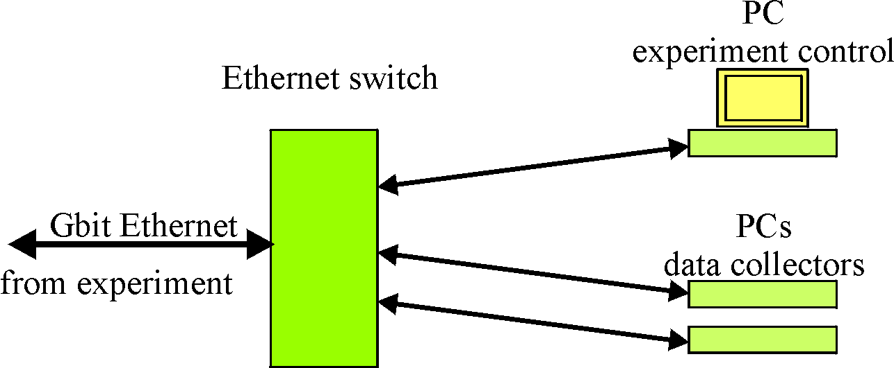

.. |space| unicode:: U+0020

Overview
========

System Layout
-------------

mesytec psd+ is a readout system for experiments with medium to large numbers
of position sensitive neutron detectors. It provides highly precise TOF timing
and allows the integration of trigger sources like monitor counters, chopper
signals, …

All events carry a 48 bit wide timestamp with **100 ns** timing resolution.

One ore more central units collect all neutron data as well as auxiliary signals
from monitor counters, chopper systems and environmental sensors.

The peripheral units, responsible for (pre-)amplification, position calculation
of the neutron events as well as for basic testing can be controlled remotely.

The following picture shows a general setup as an example:

|1000000000000660000007FD7EE5FD1B_png|

|100000000000050600000213A251655C_png|

Up to eight position sensitive detector tubes are connected to one peripheral
module MPSD-8+. Calculated event positions are transmitted on a point to point
bus connection to the central modules MCPD-8. Each MCPD-8 can serve up to 8
peripherals = 64 detectors.

Data are collected and buffered in the MCPD-8 and transmitted to one or more
control and DAQ computers. Communication uses UDP/IP on a 100 Mbit/s Ethernet
connection.

**Main Components**

mesytec psd+ systems consist of three principal components:

.. tabularcolumns:: |p{7.5cm}|p{10cm}|

.. list-table::
   :header-rows: 0

   * - | **Peripheral modules like MPSD-8+**
       | They interface to the detectors, do the analog signal processing,
         calculate energies and positions, generate digital data on positions
         and a differential timing.
       | They have several parameters (gains, thresholds, test pulsers …) that
         can be controlled remotely.
       | Data communication takes place on a dedicated high speed serial
         interface between peripheral and central modules.
     - | |100000000000081B0000052DC767CA2E_png|
   * - | **Central module MCPD-8**
       | Are responsible for data buffering, control of and communication with
         peripheral modules. They are the interface to the data acquisition and
         control computer(s).
       | Data communication takes place on the high speed serial interface
         towards the peripheral modules and on 100 Mbit/s Ethernet towards daq
         computers.
       | Communication with the MCPD-8 via UDP/IP protocol is the way to control
         all system parameters.
     - | |10000000000003F4000003EA901F38DE_png|
   * - | **Data acquisition and control computers**
       | At least one computer is required in order to control the psd+ system
         and to collect the data generated by the peripheral modules.
       | Communication takes place between computer and central module, allowing
         also to control the peripheral module parameters.
     - |

Possible Setups
----------------

The range of possible setups stretches from the minimum system, with one peripheral
module MPSD-8+, one central module MCPD-8 and one pc to large systems with multiple
fully equipped MCPD-8 branches – each serving 64 detectors on 8 MPSD-8+.

One MCPD-8 can handle up to eight peripheral modules. Communication takes place on a
deterministic point to point connection, allowing highest data rates. This setup is
recommended for instruments with high event rates and demand for lowest possible
deadtimes.

Several MCPD-8 can be combined to realize a readout system meeting the requirements
regarding number of detectors, data rates and deadtime limits.

At least one data acquisition and control computer is needed to perform three main
tasks:

* control peripheral settings (like gains, thresholds and test pulser)
* collect and store incoming raw data
* preprocess / display event data for online monitoring

In larger setups with high data rates, it can be a good decision to split the tasks,
one computer for control and online monitoring plus separate computers for data
collection and storing may be a good distribution.

Communication protocols
-----------------------

There are two protocols used among the mesytec psd+ system:

* A proprietary protocol on the high speed serial interfaces from peripheral to
  central modules. MCPD-8 serves as an interface between the control pc and the
  bus protocol.

* A protocol using the standardized UDP/IP protocol family on Ethernet for the
  communication between central modules and computers. This protocol will be
  called “mesytec protocol” in the following.

